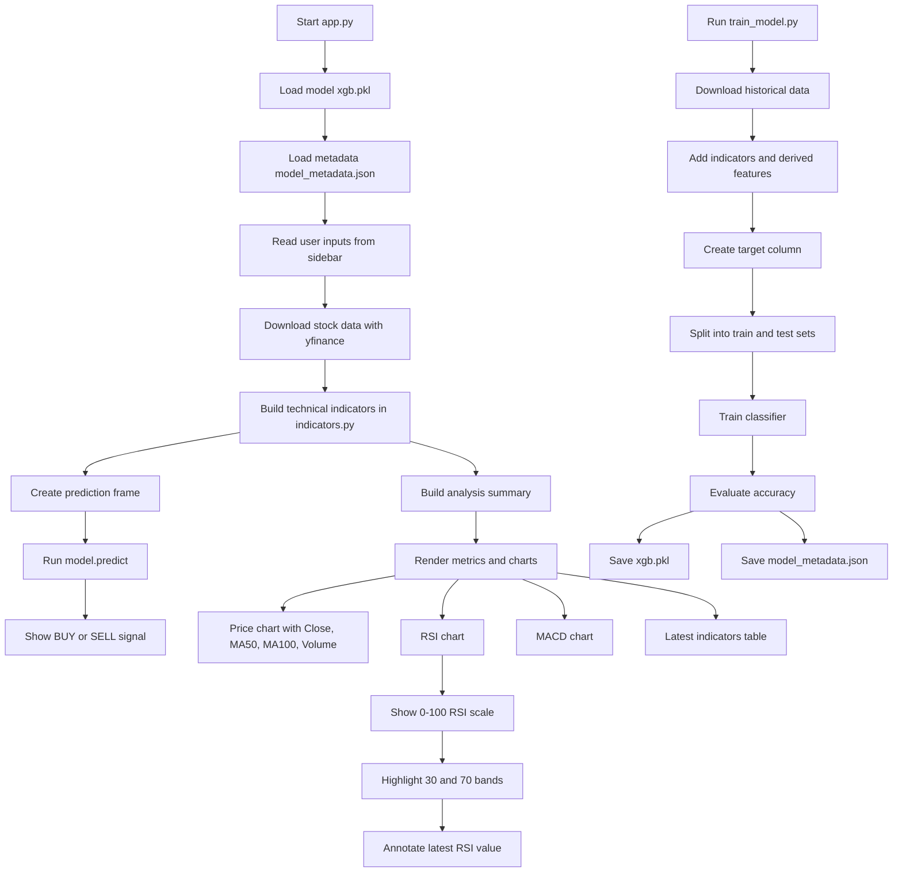

# Code Execution Flow

## Runtime Flow

1. The Streamlit app starts in `app.py`.
2. The model is loaded from `xgb.pkl`.
3. Stock data is downloaded from Yahoo Finance.
4. `indicators.py` adds RSI, MACD, moving averages, returns, volatility, and price-relative features.
5. The latest feature row is passed into the model for a BUY/SELL prediction.
6. The app renders the signal, summary text, price chart, RSI chart, MACD chart, and indicator table.
7. If model accuracy metadata is missing, the app computes a live fallback estimate.

## Training Flow

1. `train_model.py` downloads historical stock data.
2. It calls `add_indicators()` from `indicators.py`.
3. It creates the next-day target from the close price movement.
4. It builds the full feature matrix.
5. It trains the classifier and computes test accuracy.
6. It saves the trained model to `xgb.pkl`.
7. It writes accuracy and feature metadata to `model_metadata.json`.
